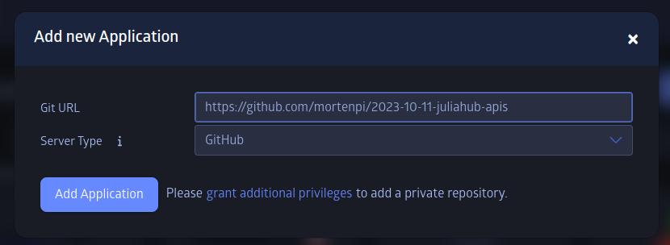
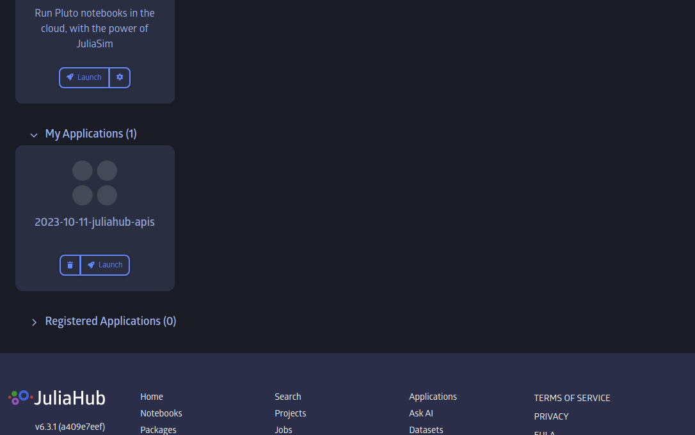
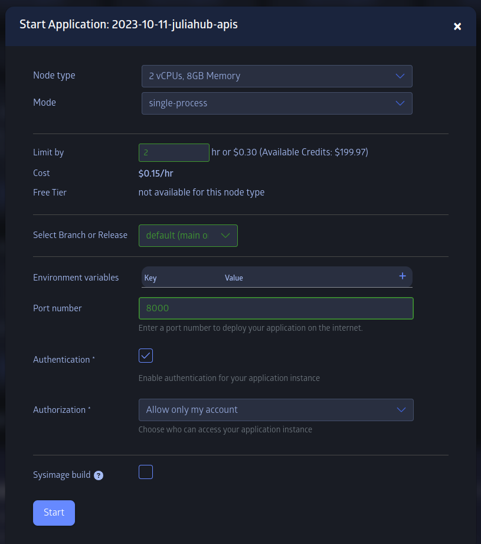
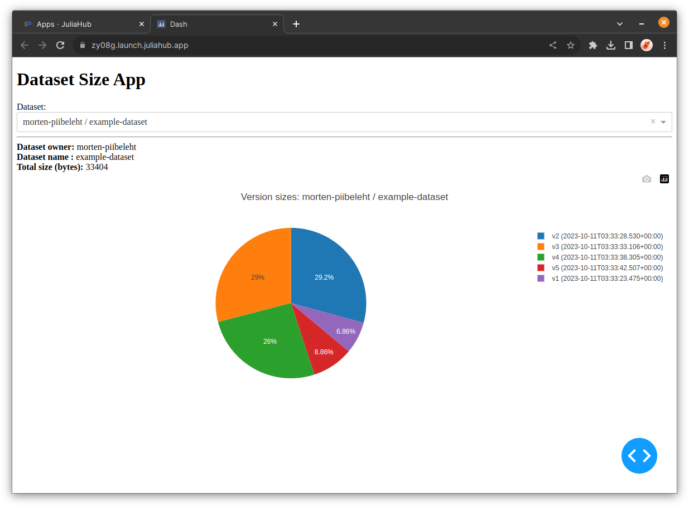

# Building apps

You can also use JuliaHub.jl in interactive applications that talk to a JuliaHub instance.

This repository duplicates as a simple [Dash application](https://github.com/plotly/Dash.jl) that you can add to JuliaHub as a "My Application".
The app then creates a simple dashboard you can connect to that uses `JuliaHub.jl`

## Launching the example on `juliahub.com`

You can add this repository to your user as a "My Application" by clicking on the "Add Application" button on the Applications page.

After you've added it, it should show up in the "My Applications" section:

You can then launch the app. Make sure you set the branch to "default (main or master)" and set a port number (so that we could connect to it via the browser).

Once that application has has time to start up (it will take a little while to install dependencies and such; it should eventually say `Listening on: 0.0.0.0:8000, thread id: 1` in the job logs), you can click "Connect" in the UI and it should show you a simple dashboard that looks something like this:

## How the application is built

Here is a summary of what is happening when the application launches:

* The application is a Julia package. The repository's `Project.toml` defines the packages dependencies etc.
* The main source code of the application lives in the `src/` directory.
* The entry point of the application is `bin/main.jl`, which simply loads the packages and calls the `run()` function. This is the script that JuliaHub runs when you launch the application.
